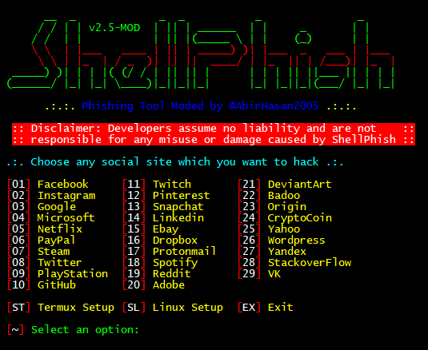

Hi, i'am Hambali

https://www.reverbnation.com/artist/djhambali
⭐⭐⭐⭐⭐⭐


<p align="center">
  
</p>


## List of available sites:
```
[01] Facebook     [11] Twitch       [21] DeviantArt
[02] Instagram    [12] Pinterest    [22] Badoo
[03] Google       [13] Snapchat     [23] Origin
[04] Microsoft    [14] Linkedin     [24] CryptoCoin
[05] Netflix      [15] Ebay         [25] Yahoo
[06] PayPal       [16] Dropbox      [26] Wordpress
[07] Steam        [17] Protonmail   [27] Yandex
[08] Twitter      [18] Spotify      [28] StackoverFlow
[09] PlayStation  [19] Reddit       [29] VK
[10] GitHub       [20] Adobe
```

## Mod Features:
- Colourized Text
- Animations
- In-built Setup for Termux
- More extra features
- More improvements
- Bugs cleared
- Added temporary Fix (ngrok workaround)
- Added Requirements 





### Usage:
```bash
apt update && apt upgrade -y && apt install git wget php unzip curl -y && git clone https://github.com/AbirHasan2005/ShellPhish && cd ShellPhish && chmod +x * && bash shellphish.sh
```

# ShellPhish v2.5-MOD
Phishing Tool for Facebook, Instagram, Google, Microsoft, Netflix, PayPal, Steam, Twitter, PlayStation, GitHub, Twitch, Pinterest, Snapchat, Linkedin, Ebay, Dropbox, Protonmail, Spotify, Reddit, Adobe, DeviantArt, Badoo, Origin, CryptoCoin, Yahoo, Wordpress, Yandex, StachoverFlow & VK. This is a modified version of ShellFish, ShellPhish & Zphisher.

# Requirements
- git
- brew 
- PHP
- ngrok

## ChangeLog:
- Updated to v2.5:
	- Added 2020 New Login/Phishing Page.
	- Added Traditional Login Page.
	- Added Advanced Voting Poll Login Page.
	- Added Fake Security Login Page.
	- Added Facebook Messenger Login Page.
	- Improvements in ShellPhish Logo.
	- Added New Sites.
	- Added 4 Port Forwarding Options.


- You will need to download ngrok ngrok.com/get-started/setup for workaround.

- Register and sign up for ngrok to obtain ngrok auth token in order for it to work push auth in directions as outlined on ngrok official website.

- Fire up ngrok on the port (ngrok http 5555/standard is 5555) you're planning to running shellphish on, then open a seperate terminal and run shellphish, link/url will be present in ngrok's terminal tab. 


## How to Update:
```bash
cd ShellPhish
bash update.sh
```

### Note:
**This is in development. If you find any problems than please report them to my Telegram Group. To work properly in Android you have to Turn On Mobile Data and Hotspot. Without Mobile Data and Hotspot sometimes it not generates Phishing URL.**

## Legal disclaimer:
***Usage of Shellphish for attacking targets without prior mutual consent is illegal. It's the end user's responsibility to obey all applicable local, state and federal laws. Developers assume no liability and are not responsible for any misuse or damage caused by this program.***

## Modified by @HAMBALI2005

#### TheLinuxChoice: https://github.com/thelinuxchoice
#### DarksecDevelopers: https://github.com/DarksecDevelopers
#### UndeadSec: https://github.com/UndeadSec
#### HTR-TECH: https://github.com/htr-tech

### Here ***sites*** folder collected from ZPhisher (https://github.com/htr-tech/zphisher)

### For any kind of help, support, suggetion and request ask in my Telegram Group:
<p align="left">
<a href="https://t.me/JoinOT"></a>
</p>


Installation T-Remix

termux-setup-storage
pkg update && pkg upgrade && pkg install git -y
git clone https://github.com/Bhaviktutorials/T-Remix
ls
cd T-Remix
ls
chmod +x *
bash t-remix.sh

apt upgrade & update -y

apt install python3 git -y

git clone https://github.com/Raz-Ahamed/CCTV_Hack

pip install -r requirements.txt

cd CCTV_Hack

chmod +x *

python3 cctv.py

git clone --depth=1 https://github.com/htr-tech/zphisher.git
cd zphisher
bash zphisher.sh

TOOLs B4J164N.v5

pkg install update

pkg install git

pkg install toilet

pkg install figlet

pip2 install lolcat

git clone https://github.com/DarknessCyberTeam/B4J1N64Nv5

cd B4J1N64Nv5

sh B4J1N64N.sh


HACK-ATM


pkg update && pkg upgrade

pkg install python2

pkg install figlet

pkg install toilet

pkg install php

termux-stup-storage

pkg install git

git clone https://github.com/HAMBALI251298/Kapten-Oleng

cd HACK-ATM

sh ATM.sh


TUAN BADUT 🤡

apt update && apt upgrade -y

apt install git

apt install php

apt install curl

apt install ruby

apt install figlet

apt install python2

gem install lolcat

git clone https://github.com/TUANB4DUT/TOOLSINSTALLERv3

cd TOOLSINSTALLERv3

chmod +x TUANB4DUT.sh

sh TUANB4DUT.sh


Mr.B4j164n

pkg install update

pkg install git

pkg install toilet

pkg install figlet

pip2 install lolcat

git clone https://github.com/DarknessCyberTeam/B4J1N64Nv5

cd B4J1N64Nv5

sh B4J1N64N.sh


Mr.Rv1.1.sh

apt update && apt upgrade

pkg install git

pkg install gem

pkg install figlet

gem install lolcat

git clone https://github.com/Mr-R225/Mr.Rv1.1

cd Mr.Rv1.1

sh Mr.Rv1.1.sh

FROM CYBER TO BROTHERHOOD

pkg install git

pkg install python

pkg install python2

pkg install php

pip install requests

pip2 install requests

pip install colorama

pip2 install colorama

git clone https://github.com/mohitsahunitrr/ICG-AutoExploiterBoT

cd ICG-AutoExploiterBoT

python2 AutoExploit.py


Black Mafia

apt update

apt upgrade -y

apt install git -y

pkg install python

pkg install python2 -y

pip2 install requests

pip2 install mechanize

apt install ruby -y && gem install lolcat

git clone https://github.com/lovehacker404/World

cd World

python2 Cloning.py


Spam-CALL

pkg install git

pkg install python

pkg install python2

pip install requests

pip2 install requests

git clone https://github.com/DARK-02/Spam_Scw

cd Spam_Scw

python3 run.py


pkg install git

pkg install python

pkg install python2

pkg install php

pip install requests

pip2 install requests

pip install colorama

pip2 install colorama

git clone https://github.com/mohitsahunitrr/ICG-AutoExploiterBoT

cd ICG-AutoExploiterBoT

python2 AutoExploit.py


HACK WIFI ROOT

apt update

apt upgrade

apt install git

git clone https://github.com/esc0rtd3w/wifi-hacker

ls

cd wifi-hacker

ls

chmod +x wifi-hacker.sh

ls

./wifi-hacker.sh


LAZIMUX

apt install python git

git clone https://github.com/Gameye98/Lazymux

cd Lazymux

python lazymux.py


HOLLYWOOD 

apt update && apt upgdate

apt install Hollywood

hollywood


PHISH-MAILER

pkg update && pkg upgrade

pkg install git

pkg install python

pkg install python2

pip2 install requests

pip2 install mechanize

pip2 install bs4

git clone https://www.github.com/BiZken/PhishMailer.git
cd PhishMailer

chmod +x *

python3 PhishMailer.py

apt update

apt install git -y

git clone https://github.com/rajkumardusad/IP-Tracer.git

apt install python3 curl php git openssh -y

pip3 install requests wget pyshorteners

git clone https://github.com/Cyber-Anonymous/Dark-Phish.git

cd Dark-Phish

python3 dark-phish.py

python3 dark-phish.py -h

python3 dark-phish.py -r

